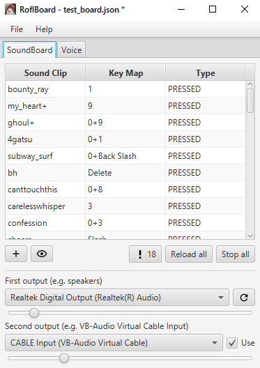

  

---

# RoflBoard

> Simple soundboard

*Screenshot*

Features:

* Soundboard
    * Configs can be saved / loaded as JSON file
    * Sounds can be played fully / only when pressed / toggled
    * Supports key combinations
    * Keymap preview
    * Warnings: sound length, starting silence length, errors
* Voice changer
    * Transmits voice to output device on key press
    * Pitch, Gain, HighPass filters

Current limitations:

* Only supports `.wav` files
* Requires JRE 17+ with JavaFX on non-Windows platforms (e.g. Azul Zulu)

## Installation

> Need [some kind of loop back software](https://vb-audio.com/Cable/) to be installed prior usage

* On windows: download and run `.msi` file from Releases
* On linux:
    * Download JRE 17+ with JavaFX (e.g. Azul Zulu)
    * Download `.zip` file and run script in `bin` directory

## Usage

* Select output devices (the second one should be `loopback`, e.g. `VB-CABLE Virtual Audio`)
* Select input device (in `Voice` tab)
* Add sounds
* Disable push-to-talk in your app (enable voice activity)
* Have fun